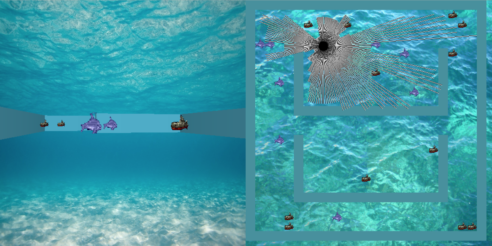

# Waterworld

This repository contains code for a simple simulated underwater environment where the agent has to navigate and remove all the submarines while avoiding the dolphins and walls. The agent can recieve first person view input or distance readings to the surounding objects simulating lidar. 

###Setup
To run the simulation first setup the anaconda environment.

conda env create -f environment.yml

###Running
Then run the run_human.py script

Control the agent with the 'W, A, S D' keys. 

